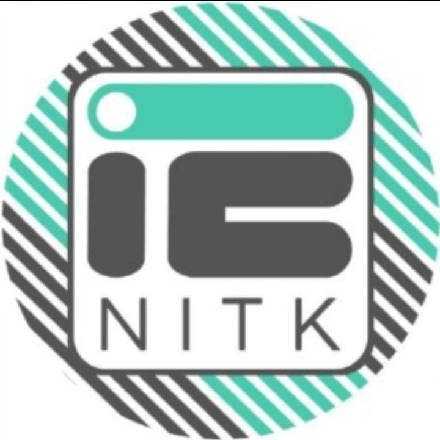

<!--
*** Thanks for checking out the Best-README-Template. If you have a suggestion
*** that would make this better, please fork the repo and create a pull request
*** or simply open an issue with the tag "enhancement".
*** Thanks again! Now go create something AMAZING! :D
-->

<!-- PROJECT SHIELDS -->
<!--
*** I'm using markdown "reference style" links for readability.
*** Reference links are enclosed in brackets [ ] instead of parentheses ( ).
*** See the bottom of this document for the declaration of the reference variables
*** for contributors-url, forks-url, etc. This is an optional, concise syntax you may use.
*** https://www.markdownguide.org/basic-syntax/#reference-style-links
-->
<!--
[![Contributors][contributors-shield]][contributors-url]
[![Forks][forks-shield]][forks-url]
[![Stargazers][stars-shield]][stars-url]
[![Issues][issues-shield]][issues-url]
[![MIT License][license-shield]][license-url]
[![LinkedIn][linkedin-shield]][linkedin-url]
-->

<!-- PROJECT LOGO -->
 

  

  <h3 align="center">Search Engine</h3>

  

    A website to search for questions and corresponding answers related to a query which the user has.
     
    <a href="https://github.com/IE-NITK/IE_Web_Search_Application"><strong>Explore the docs »</strong></a>
     
     
    <a href="https://github.com/IE-NITK/IE_Web_Search_Application">View Demo</a>
    ·
    <a href="https://github.com/IE-NITK/IE_Web_Search_Application/issues">Report Bug</a>
    ·
    <a href="https://github.com/IE-NITK/IE_Web_Search_Application/issues">Request Feature</a>
  

<!-- TABLE OF CONTENTS -->

  
Table of Contents

  <ol>
    <li>
      <a href="#about-the-project">About The Project</a>
      <ul>
        <li><a href="#built-with">Built With</a></li>
      </ul>
    </li>
    <li>
      <a href="#getting-started">Getting Started</a>
      <ul>
        <li><a href="#Prerequisites-and-Installations">Prerequisites and Installations</a></li>
        <li><a href="#INSTRUCTIONS">INSTRUCTIONS</a></li>
      </ul>
    </li>
    <li><a href="#roadmap">Roadmap</a></li>
    <li><a href="#contributing">Contributing</a></li>
  </ol>

<!-- ABOUT THE PROJECT -->
## About The Project

[![Product Name Screen Shot][product-screenshot]](https://github.com/IE-NITK/IE_Web_Search_Application)

A website which saves u the hassle of searching through websites for ur queries by getting the top questions and corresponding answers related to ur query without the trouble of having to jump through various links to reach the answers u want.

### Built With

* [Elasticsearch](https://elasticsearch-py.readthedocs.io/en/7.10.0/index.html#)
* [Flask](https://flask-doc.readthedocs.io/en/latest/#)
* [Scrapy](https://docs.scrapy.org/en/latest/#)

<!-- GETTING STARTED -->
## Getting Started

### Prerequisites and Installations

* elastic search:
  install [elastic search](https://www.elastic.co/guide/en/elasticsearch/reference/current/install-elasticsearch.html)
* flask:
  install [flask](https://flask.palletsprojects.com/en/1.1.x/installation/)
* universal encoder:
  download [universal encoder zip ](https://tfhub.dev/google/universal-sentence-encoder/4) and them to a folder called universal_encoder.

### INSTRUCTIONS
1. cd into elasticsearch-7.10.1(the folder where u have installed elastic search) and run (`.\bin\elasticsearch.bat`)
2. Add the universal_encoder folder to spiders folder.
3. in a new terminal cd into spiders and run (`scrapy crawl stackoverflow -o <output file name>.json`)
4. Move the universal_encoder folder back to IE_Web_Search_Application.
5. unzip static.rar into IE_Web_Search_Application.
6. cd into IE_Web_Search_Application and run (`python app.py`) 

<!-- USAGE EXAMPLES 
## Usage

Use this space to show useful examples of how a project can be used. Additional screenshots, code examples and demos work well in this space. You may also link to more resources.

_For more examples, please refer to the [Documentation](https://example.com)_

-->

<!-- ROADMAP -->
## Roadmap

See the [open issues](https://github.com/IE-NITK/IE_Web_Search_Application/issues) for a list of proposed features (and known issues).

<!-- CONTRIBUTING -->
## Contributing

Contributions are what make the open source community such an amazing place to be learn, inspire, and create. Any contributions you make are **greatly appreciated**.

1. Fork the Project
2. Create your Feature Branch (`git checkout -b feature/AmazingFeature`)
3. Commit your Changes (`git commit -m 'Add some AmazingFeature'`)
4. Push to the Branch (`git push origin feature/AmazingFeature`)
5. Open a Pull Request

<!-- LICENSE 
## License

Distributed under the MIT License. See `LICENSE` for more information.

-->

<!-- CONTACT 
## Contact

Your Name - [@your_twitter](https://twitter.com/your_username) - email@example.com

Project Link: [https://github.com/your_username/repo_name](https://github.com/your_username/repo_name)

-->

<!-- ACKNOWLEDGEMENTS 
## Acknowledgements
* [GitHub Emoji Cheat Sheet](https://www.webpagefx.com/tools/emoji-cheat-sheet)
* [Img Shields](https://shields.io)
* [Choose an Open Source License](https://choosealicense.com)
* [GitHub Pages](https://pages.github.com)
* [Animate.css](https://daneden.github.io/animate.css)
* [Loaders.css](https://connoratherton.com/loaders)
* [Slick Carousel](https://kenwheeler.github.io/slick)
* [Smooth Scroll](https://github.com/cferdinandi/smooth-scroll)
* [Sticky Kit](http://leafo.net/sticky-kit)
* [JVectorMap](http://jvectormap.com)
* [Font Awesome](https://fontawesome.com)
-->

<!-- MARKDOWN LINKS & IMAGES -->
<!-- https://www.markdownguide.org/basic-syntax/#reference-style-links -->
[contributors-shield]: https://img.shields.io/github/contributors/othneildrew/Best-README-Template.svg?style=for-the-badge
[contributors-url]: https://github.com/IE-NITK/IE_Web_Search_Application/graphs/contributors
[forks-shield]: https://img.shields.io/github/forks/othneildrew/Best-README-Template.svg?style=for-the-badge
[forks-url]: https://github.com/IE-NITK/IE_Web_Search_Application/network/members
[stars-shield]: https://img.shields.io/github/stars/othneildrew/Best-README-Template.svg?style=for-the-badge
[stars-url]: https://github.com/IE-NITK/IE_Web_Search_Application/stargazers
[issues-shield]: https://img.shields.io/github/issues/othneildrew/Best-README-Template.svg?style=for-the-badge
[issues-url]: https://github.com/IE-NITK/IE_Web_Search_Application/issues
[license-shield]: https://img.shields.io/github/license/othneildrew/Best-README-Template.svg?style=for-the-badge
[license-url]: https://github.com/IE-NITK/IE_Web_Search_Application/blob/master/LICENSE.txt
[linkedin-shield]: https://img.shields.io/badge/-LinkedIn-black.svg?style=for-the-badge&logo=linkedin&colorB=555
[linkedin-url]: https://linkedin.com/in/othneildrew
[product-screenshot]: images/screenshot.png
